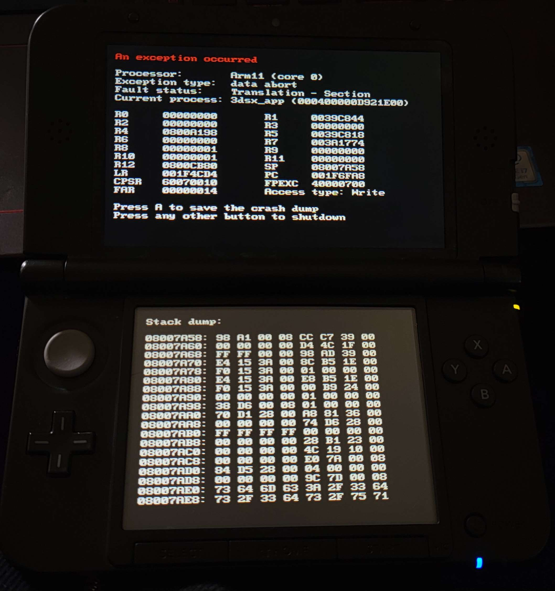

# uqm-3ds ( This shit almost work? )

An unsuccessful and broken attempt to port the Ur-Quan masters to the Nintendo 3DS.
This shit just straight up doesn't work.

Now builds ( at least I suppose? )
Make sure pkg-config is installed with DevKitPro and install required libaries.
```
pacman -S 3ds-zlib 3ds-sdl_ttf 3ds-sdl_mixer 3ds-sdl_image 3ds-sdl_gfx 3ds-sdl 3ds-mikmod 3ds-libvorbisidec 3ds-libpng 3ds-libogg
```
Navigate into uqm-0.8.0 and run Make and pray to jesus it works without changing the Makefile.

Project configured for VSCode on Windows, change c_cpp_properties.json C:\ paths to /opt/ if you use linux like a normal person.

Currently crashes on Citra half of the time complaining that "ConfigureNew3DSCPU" does not exist, hang indefinitely in other cases.
Also crashes on real hardware!

Obviously I'm not experienced enough to debug this or know where to begin to start so consider this an epic cry for help.
